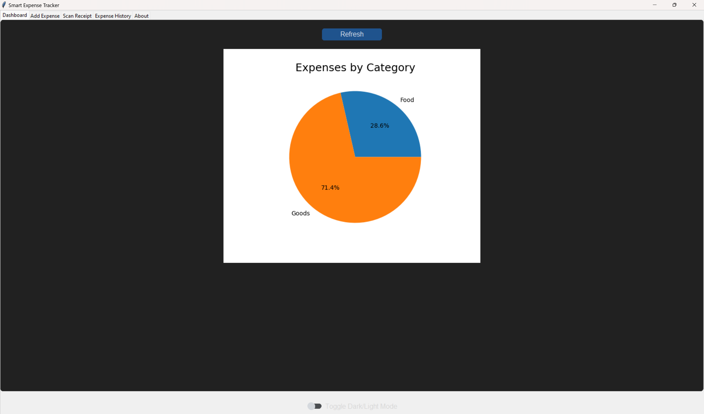

# 💸 Smart Expense Tracker

**Smart Expense Tracker** is an intelligent personal finance management application built with Python and Tkinter. It offers powerful features like voice input, OCR receipt scanning, data visualization, dark/light themes, and database-backed expense history management.

---

## ✨ Features

- 🎙️ **Voice Expense Entry** – Add expenses using speech (e.g., "Add 200 groceries").
- 📸 **OCR Receipt Scanner** – Upload receipt images and extract text using Tesseract.
- 📊 **Dashboard Visuals** – See your spending by category in a live pie chart.
- 📅 **Expense History Viewer** – Browse, edit, and delete past expenses.
- 🔍 **Search Function** – Filter history by amount, category, or description.
- 🌓 **Dark/Light Mode** – Beautiful modern UI with a theme toggle.
- 🧾 **SQLite Database** – All expenses are stored locally in `expenses.db`.
- 🛠️ **Edit/Delete** – Modify or remove entries easily through the UI.

---

## 📷 Preview

> 

---

## 🚀 Getting Started

### 1. Clone the Repository

```bash
git clone https://github.com/shiboshree/smart-expense-tracker.git
cd smart-expense-tracker
```

### 2. Install Dependencies

Make sure you have Python 3.8+ installed.

```bash
pip install customtkinter pillow opencv-python pytesseract matplotlib SpeechRecognition
```

Also install Tesseract OCR (required for receipt scanning):

- **macOS (Homebrew)**:
  ```bash
  brew install tesseract
  ```
- **Windows**: [Download installer](https://github.com/tesseract-ocr/tesseract/wiki)

### 3. Run the App

```bash
python ExpenceTracker.py
```

---

## 📂 Project Structure

```
smart-expense-tracker/
│
├── ExpenceTracker.py             # Main application file
├── expenses.db         # SQLite database (auto-created)
├── README.md           # You're here!
```

---
## 📦 Download

👉 [Click here to download the ExpenceTracker for Windows](https://www.mediafire.com/file/m426j4lp7t0qj15/ExpenceTracker.exe/file)

## 🧠 Technologies Used

- Python
- Tkinter + CustomTkinter (modern GUI)
- SQLite3 (local database)
- OpenCV + Tesseract OCR
- Matplotlib (dashboard charts)
- SpeechRecognition (voice input)

---

## 👤 About

- **Project Name:** Smart Expense Tracker  
- **Developer:** Shiboshree Roy  
- **Version:** 1.0  
- **Email:** [shiboshreeroy169@gmail.com](mailto:shiboshreeroy169@gmail.com)

---

## 📜 License

This project is licensed under the MIT License.

